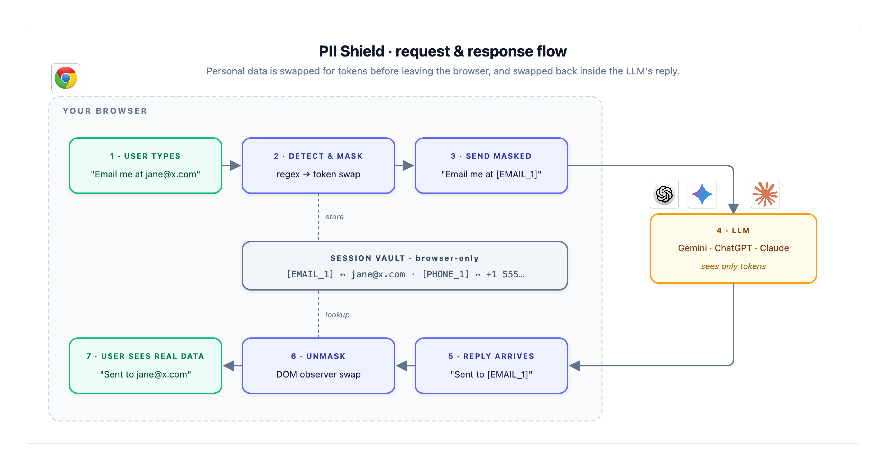

# PII Shield

A Chrome extension that detects and masks personal information in AI chat inputs (Gemini, ChatGPT, Claude), then unmasks the assistant's reply so you see your original data. Runs fully offline — nothing leaves your browser.

## Workflow

## How it works

1. **Detect.** A content script runs on supported AI sites and scans the chat input as you type, using regex patterns for emails, phone numbers, SSNs, credit cards, IPs, dates of birth, passports, API keys, and any custom patterns you define.
2. **Mask.** When you hit Send (or Enter), each piece of PII is replaced with a stable placeholder token like `[EMAIL_1]` or `[PHONE_2]`. The original value never leaves your browser.
3. **Vault.** The token-to-original mapping is kept in `chrome.storage.session`, so it lives only for the current browser session and is invisible to the page.
4. **Send.** The LLM receives only the masked text. It treats tokens as opaque labels and echoes them back in its reply.
5. **Unmask.** A `MutationObserver` watches the assistant's response as it streams in. Any token it spots is swapped back to the real value from the vault, so you read the reply with your original data inline.
6. **Disable safely.** Turning the shield off mid-conversation reverts the displayed reply back to tokens — what you see always matches what the LLM actually has.

## Supported sites

- `gemini.google.com`
- `chatgpt.com`
- `claude.ai`

## Install (developer mode)

1. Clone this repo.
2. Open `chrome://extensions`, enable **Developer mode**.
3. Click **Load unpacked** and select this folder.
4. Open the extension's popup or options page to toggle categories, sites, and custom patterns.
